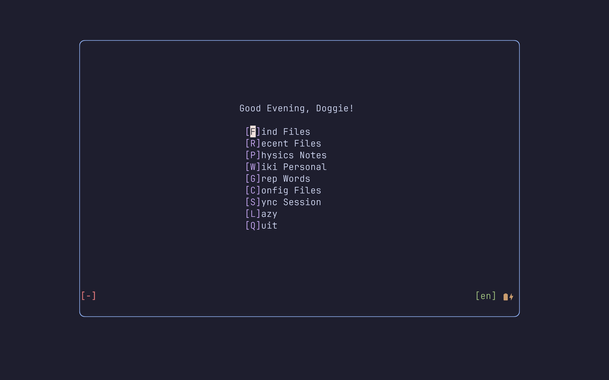

# 极小 neovim 输入方案，仅包含必要的输入插件，专注于快速输入

本插件是我自己使用的 neovim 插件，它包含了一套我个人逐渐修改的输入方案与工作流。包含

* 输入法，基于[rime-ls](https://github.com/wlh320/rime-ls) 与 [blink-cmp](https://github.com/Saghen/blink.cmp) 实现。这是本配置最为关键的部分，经过一定个性化修改，支持：
 * 中文英文在公式环境下的自动切换；
 * 中文英文标点自动切换；
符合大部分日常写作需要。

* 格式化，使用了 [autocorrect](https://github.com/huacnlee/autocorrect) 插件，保证中英文混合输入的格式化。

* $\LaTeX$ 撰写与[zathura](https://github.com/pwmt/zathura) 预览的无缝切换 (主要是保证在终端与 zathura 切换过程中的快捷键一致性)，使用 [Hammerspoon](https://github.com/Hammerspoon/hammerspoon) 重定义了特定的键映射，并使用 neovim 自带的 remote 功能实现外部调用。

* 符合个人习惯的 [luasnip](https://github.com/L3MON4D3/LuaSnip)，包含部分基于`python` 的$\LaTeX$ 计算器。

* 基于 [better-escape](https://github.com/max397574/better-escape.nvim)的无阻碍文本快捷键 (如`jj` 退出插入模式，`jn` 切换输入法等等)，不会在 `vim.o.timeoutlen` 时间内阻碍输入。

更多杂项配置可以参考本仓库，也可以查找本人过去的配置 (大而全，基于[LazyVim](https://github.com/LazyVim/LazyVim)，因为维护总是要看社区的习惯，有时候会引入破坏性更新，我不是特别喜欢)。过去的配置会陆续转移到这里，但这个配置会专注于工作流本身的优化，而对新特性的增加保持谨慎态度。
